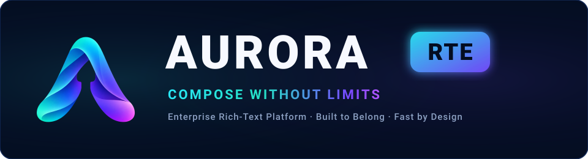

<p align="center">
  <picture>
    <source media="(prefers-color-scheme: dark)" srcset="public/assets/branding/aurora-logo.svg">
    
  </picture>
</p>

<p align="center">
  <strong>Enterprise-Grade Modern Rich-Text &amp; HTML5 Authoring Engine</strong><br>
  <em>Framework-agnostic core, native React 19 &amp; Angular 17+ components, Custom Elements v1 Web Component, standalone zero-install CDN bundle, bi-directional HTML source mode, and collaborative review workflows.</em>
</p>

<p align="center">
  <a href="https://ramanacr.github.io/aurora-rte/">
    
  </a>
  <a href="https://github.com/ramanacr/aurora-rte/packages">
    
  </a>
  <a href="https://github.com/ramanacr/aurora-rte/releases">
    
  </a>
</p>

<p align="center">
  <a href="https://github.com/ramanacr/aurora-rte/releases"></a>
  <a href="LICENSE"></a>
  <a href="https://www.typescriptlang.org/"></a>
  <a href="https://react.dev/"></a>
  <a href="https://angular.dev/"></a>
  <a href="https://developer.mozilla.org/en-US/docs/Web/API/Web_components"></a>
  <a href="tests"></a>
  <a href="https://www.w3.org/WAI/standards-guidelines/wcag/"></a>
</p>

---


## Table of Contents

- [Key Highlights](#key-highlights)
- [Architecture & Monorepo Packages](#architecture--monorepo-packages)
- [Installation & Registry Configuration](#installation--registry-configuration)
- [Quick Start Guide](#quick-start-guide)
  - [Option 1: Zero-Install Standalone CDN Script](#option-1-zero-install-standalone-cdn-script-vanilla-html)
  - [Option 2: Modern Web Component (`<aurora-editor>`)](#option-2-modern-web-component-custom-elements-v1)
  - [Option 3: React 18 / 19 Integration](#option-3-react-18--19-integration)
  - [Option 4: Angular 17+ Standalone Component](#option-4-angular-17-standalone-component)
- [Complete Public API Reference](#complete-public-api-reference)
  - [`createEditor(options)`](#createeditoroptions)
  - [`AuroraEditor` Instance Methods](#auroraeditor-instance-methods)
  - [Available Commands Reference](#available-commands-reference)
  - [Events & Listeners](#events--listeners)
  - [Import & Export Utilities](#import--export-utilities)
  - [Document AST Schema (`AuroraDocument`)](#document-ast-schema-auroradocument)
- [Framework Integration Deep Dives](#framework-integration-deep-dives)
  - [React 19 Deep Dive (Components, Ref API & Hooks)](#react-19-deep-dive)
  - [Angular 17+ Deep Dive (Reactive Forms, DI & Control Flow)](#angular-17-deep-dive)
  - [Web Component Deep Dive (Lifecycle, Methods & Attributes)](#web-component-deep-dive)
- [Enterprise Features & Authoring Capabilities](#enterprise-features--authoring-capabilities)
  - [W3C Semantic HTML5 Authoring Spec](#w3c-semantic-html5-authoring-spec)
  - [Bi-directional Raw HTML Source Mode](#bi-directional-raw-html-source-mode)
  - [Interactive Table Engine (Drag Resizing & Context Menu)](#interactive-table-engine)
  - [Real-Time Collaboration & Presence Carets](#real-time-collaboration--presence-carets)
  - [Enterprise Review (Track Changes & Inline Comments)](#enterprise-review-track-changes--inline-comments)
  - [WCAG 2.1 AA Accessibility Auditor](#wcag-21-aa-accessibility-auditor)
- [Styling, Theming & CSS Variables](#styling-theming--css-variables)
- [Security, Sanitization & Content Policy](#security-sanitization--content-policy)
- [Packaging, Releases & Versioning](#packaging-releases--versioning)
- [Contributing & Local Development](#contributing--local-development)
- [License](#license)

---

## Key Highlights

- ⚡ **Framework Freedom**: Native zero-overhead adapters for **React 19**, **Angular 17+** (standalone, `@if`/`@for`), **Web Components** (Custom Elements v1 with Shadow DOM), or headless **Vanilla JS**.
- 🌐 **Zero-Install CDN Bundle**: Pre-bundled single-file IIFE bundle (`aurora-editor.min.js`) for immediate drop-in via standard `<script>` tag.
- 📐 **Full HTML Authoring Spec**: Native block insertion, palette pickers, and live inspectors for semantic elements: `<figure>`, `<figcaption>`, `<details>`, `<summary>`, `<dialog>`, `<form>`, `<fieldset>`, `<legend>`, `<address>`, `<time>`, `<ruby>`, and `<pre><code>`.
- 🔀 **Bi-directional Live-Sync Source Mode**: Split or standalone raw HTML editor with live debounced AST re-parsing, legacy tag migration (`<font>` $\rightarrow$ `<span>`, `<center>` $\rightarrow$ `<div>`), and strict sanitization.
- 📊 **Full-Scale Table Engine**: Interactive drag-resize handles for columns and rows, full context menu, properties dialog (borders, background, padding, alignment), and cell merging/splitting.
- 👥 **Real-Time Collaboration & Presence**: Live remote carets with client-specific color tagging and debounced conflict-free synchronization.
- 📝 **Enterprise Review Workflow**: Inline anchored comment threads, visual suggestion diffs (Track Changes: green underline additions, red strikethrough deletions), and audit logging.
- ♿ **WCAG 2.1 AA Accessibility Auditor**: Real-time evaluation of color contrast, missing image `alt` attributes, unassociated form labels, and table header scopes with one-click auto-fixes.
- 🛡️ **Zero-Trust Security**: Multi-tier sanitization stripping dangerous scripts, invalid URL protocols (`javascript:`, `vbscript:`), and unauthorized event attributes.

---

## Architecture & Monorepo Packages

Aurora RTE is organized as a high-performance modular monorepo:

| Package | Description | Target / Distribution |
| :--- | :--- | :--- |
| **`@aurora/editor`** | Core editor facade, command registry, export pipelines, and event dispatchers. | ESM + `.d.ts` |
| **`@aurora/model`** | Canonical JSON AST document schema, validation, and migration rules. | ESM + `.d.ts` |
| **`@aurora/ui`** | Headless UI controls, single-row cascading toolbar, context menus, source mode view, and dialogs. | ESM + `.d.ts` |
| **`@aurora/features`** | Standard formatting commands, list extensions, embeds, and history management. | ESM + `.d.ts` |
| **`@aurora/extension-sdk`** | Extensibility API for authoring custom blocks, marks, schema nodes, and plugins. | ESM + `.d.ts` |
| **`@aurora/web-component`** | Standalone Custom Element (`<aurora-editor>`) + IIFE CDN distribution (`aurora-editor.min.js`). | Custom Elements v1 + IIFE |
| **`@aurora/react`** | Native React 18 & 19 wrapper, hook-driven state (`useRteContext()`), and subcomponent suite. | React ESM + `.d.ts` |
| **`@aurora/angular`** | Standalone Angular 17+ components with `ControlValueAccessor` (`[(ngModel)]`, `ReactiveFormsModule`). | Angular Standalone ESM |
| **`@aurora/enterprise-review`** | Suggestion diff tracker, anchored comment threads, and audit event logs. | ESM + `.d.ts` |
| **`@aurora/engine-prosemirror`** | *(Internal)* Encapsulated engine adapter; strictly isolated behind `@aurora/editor`. | Private Monorepo Package |

---

## Installation & Registry Configuration

Packages are distributed via [GitHub Packages (`@ramanacr/aurora-*`)](https://github.com/ramanacr/aurora-rte/packages) or your internal package proxy.

### 1. Configure `.npmrc`
Add the following line to your root `.npmrc`:

```ini
@aurora:registry=https://npm.pkg.github.com
@ramanacr:registry=https://npm.pkg.github.com
//npm.pkg.github.com/:_authToken=${GITHUB_TOKEN}
```

### 2. Install Your Preferred Integration

```bash
# For Vanilla JS / Web Component:
pnpm add @aurora/web-component @aurora/editor @aurora/model

# For React (React 18 or 19):
pnpm add @aurora/react @aurora/editor @aurora/model @aurora/ui

# For Angular (Angular 17 or 18):
pnpm add @aurora/angular @aurora/editor @aurora/model @aurora/ui

# For Enterprise Review & Collaboration:
pnpm add @aurora/enterprise-review
```

---

## Quick Start Guide

### Option 1: Zero-Install Standalone CDN Script (Vanilla HTML)

Include the pre-bundled IIFE script in your HTML. No bundler or package manager needed:

```html
<!DOCTYPE html>
<html lang="en">
<head>
  <meta charset="UTF-8">
  <title>Aurora RTE Embedding</title>
  <!-- Load Aurora Editor Standalone Bundle -->
  <script src="https://cdn.jsdelivr.net/gh/ramanacr/aurora-rte@main/packages/web-component/dist/bundle/aurora-editor.min.js"></script>
  <style>
    aurora-editor {
      width: 100%;
      max-width: 900px;
      min-height: 400px;
      margin: 20px auto;
      box-shadow: 0 4px 16px rgba(0, 0, 0, 0.08);
      border-radius: 8px;
    }
  </style>
</head>
<body>

  <!-- Aurora Editor Custom Element -->
  <aurora-editor id="my-editor" theme="light" toolbar="true"></aurora-editor>

  <script>
    const editorEl = document.getElementById('my-editor');

    // Wait for the editor to initialize
    editorEl.addEventListener('aurora-ready', () => {
      console.log('Aurora Editor is ready!');

      // Populate initial content
      editorEl.setDocument({
        format: 'aurora',
        version: 1,
        content: [
          { type: 'heading', attributes: { level: 1 }, content: [{ type: 'text', text: 'Welcome to Aurora RTE' }] },
          { type: 'paragraph', content: [{ type: 'text', text: 'This editor was embedded with a single script tag.' }] }
        ]
      });
    });

    // Listen to document changes
    editorEl.addEventListener('aurora-change', (e) => {
      console.log('Document updated:', e.detail);
      // Export as HTML
      const html = editorEl.export({ format: 'html' });
      console.log('Serialized HTML:', html);
    });
  </script>
</body>
</html>
```

---

### Option 2: Modern Web Component (Custom Elements v1)

```ts
import '@aurora/web-component';
import type { AuroraEditorElement } from '@aurora/web-component';

const editor = document.createElement('aurora-editor') as AuroraEditorElement;
editor.setAttribute('theme', 'light');
document.body.appendChild(editor);

editor.addEventListener('aurora-ready', () => {
  // Execute formatting commands directly
  editor.execute('insertText', { text: 'Hello Aurora!' });
  editor.execute('toggleBold');
});
```

---

### Option 3: React 18 / 19 Integration

```tsx
import React, { useRef } from 'react';
import {
  AuroraEditor,
  type AuroraEditorRef,
  type EditorChange
} from '@aurora/react';
import type { AuroraDocument } from '@aurora/model';

const initialDoc: AuroraDocument = {
  format: 'aurora',
  version: 1,
  content: [
    {
      type: 'heading',
      attributes: { level: 2 },
      content: [{ type: 'text', text: 'Native React 19 Editor' }]
    },
    {
      type: 'paragraph',
      content: [{ type: 'text', text: 'Rich-text editing with complete hook integration.' }]
    }
  ]
};

export function MyEditor() {
  const editorRef = useRef<AuroraEditorRef>(null);

  const handleChange = (change: EditorChange) => {
    console.log('Content changed:', change);
  };

  const handleExportHtml = () => {
    if (editorRef.current) {
      const html = editorRef.current.export({ format: 'html' });
      console.log('Exported HTML:', html);
    }
  };

  return (
    <div style={{ maxWidth: 960, margin: '0 auto' }}>
      <button onClick={handleExportHtml}>Export HTML</button>
      <AuroraEditor
        ref={editorRef}
        document={initialDoc}
        toolbar={true}
        enableAuthoringFeatures={true}
        enableMobileActions={true}
        onChange={handleChange}
        style={{ minHeight: 450 }}
      />
    </div>
  );
}
```

---

### Option 4: Angular 17+ Standalone Component

#### In your Component:
```ts
import { Component, signal } from '@angular/core';
import { FormsModule } from '@angular/forms';
import { AuroraEditorComponent } from '@aurora/angular';
import type { AuroraDocument } from '@aurora/model';

@Component({
  selector: 'app-article-editor',
  standalone: true,
  imports: [FormsModule, AuroraEditorComponent],
  template: `
    <div class="editor-shell">
      <!-- Supports full ControlValueAccessor: ngModel or reactive formControl -->
      <aurora-editor
        [(ngModel)]="documentModel"
        [toolbar]="true"
        [enableMobileActions]="true"
        (selectionChange)="onSelectionChange($event)"
        class="custom-aurora-theme">
      </aurora-editor>
    </div>
  `,
  styles: [`
    .editor-shell {
      max-width: 1000px;
      margin: 2rem auto;
      border: 1px solid #e2e8f0;
      border-radius: 8px;
    }
  `]
})
export class ArticleEditorComponent {
  documentModel: AuroraDocument = {
    format: 'aurora',
    version: 1,
    content: [
      {
        type: 'heading',
        attributes: { level: 2 },
        content: [{ type: 'text', text: 'Angular 17+ Standalone Editor' }]
      }
    ]
  };

  onSelectionChange(selection: any) {
    console.log('Caret position:', selection);
  }
}
```

---

## Complete Public API Reference

### `createEditor(options)`

Creates a headless, framework-independent instance of the Aurora Editor.

```ts
import { createEditor, type AuroraEditor, type EditorOptions } from '@aurora/editor';

const editor: AuroraEditor = createEditor({
  element: document.getElementById('editor-mount'), // Optional mount container
  document: initialAuroraDocument,                  // Initial AuroraDocument AST
  editable: true,                                   // Default: true
  upload: {                                         // Custom asset upload adapter
    async uploadFile(file: File) {
      const url = await myServerUpload(file);
      return { url, alt: file.name, title: file.name };
    }
  },
  theme: {
    preset: 'light',
    tokens: {
      '--aurora-primary': '#0284c7'
    }
  }
});
```

#### Options Signature (`EditorOptions`):
| Property | Type | Default | Description |
| :--- | :--- | :--- | :--- |
| `element` | `HTMLElement \| null` | `null` | Target DOM element where the editor canvas is mounted. |
| `document` | `AuroraDocument` | Paragraph | Initial AST document. Automatically validated against schema. |
| `editable` | `boolean` | `true` | Toggle read-only vs editable mode. |
| `upload` | `HostUploadAdapter` | `undefined` | Custom file/image upload handler returning a URL promise. |
| `features` | `unknown[]` | `[]` | Feature extensions and command plugins to activate. |
| `theme` | `{ preset?, tokens? }` | `undefined` | Theming tokens and preset overrides. |

---

### `AuroraEditor` Instance Methods

An active instance exposes the following core methods:

```ts
interface AuroraEditor {
  // Mount / Lifecycle
  getElement(): HTMLElement | null;
  destroy(): void;
  isEditable(): boolean;
  setEditable(editable: boolean): void;
  focus(options?: { preventScroll?: boolean }): void;

  // Document State
  getDocument(): AuroraDocument;
  setDocument(document: AuroraDocument): void;

  // Command Execution
  execute(name: CommandName | string, input?: unknown): CommandResult;

  // Serialization & Export
  export(input: { format: 'html' | 'markdown' | 'text' | 'json' }): string;

  // Event Subscriptions
  on<K extends EditorEventName>(event: K, listener: EditorListener<K>): () => void;
}
```

---

### Available Commands Reference

Execute commands programmatically via `editor.execute(commandName, payload)`:

#### Inline & Text Formatting
```ts
editor.execute('toggleBold');
editor.execute('toggleItalic');
editor.execute('toggleUnderline');
editor.execute('toggleStrike');
editor.execute('toggleCode');
editor.execute('toggleSubscript');
editor.execute('toggleSuperscript');
editor.execute('clearFormatting');

// Typography & Colors
editor.execute('setFontFamily', { fontFamily: 'Inter, sans-serif' });
editor.execute('setFontSize', { fontSize: '18px' });
editor.execute('setTextColor', { color: '#ef4444' });
editor.execute('setTextHighlight', { color: '#fef08a' });
```

#### Block Structure & Headings
```ts
editor.execute('setHeading', { level: 1 }); // level: 1 | 2 | 3 | 4 | 5 | 6
editor.execute('setParagraph');
editor.execute('toggleBlockquote');
editor.execute('toggleCodeBlock', { language: 'typescript' });
editor.execute('toggleBulletList');
editor.execute('toggleOrderedList');
editor.execute('insertHorizontalRule');
editor.execute('insertCallout', { type: 'tip', title: 'Pro Tip' });
editor.execute('insertDetails', { summary: 'Click to expand' });
```

#### Alignment
```ts
editor.execute('alignLeft');
editor.execute('alignCenter');
editor.execute('alignRight');
editor.execute('alignJustify');
```

#### Links, Media & Embeds
```ts
editor.execute('setLink', { href: 'https://example.com', target: '_blank', title: 'Example' });
editor.execute('removeLink');
editor.execute('insertImage', { src: 'https://example.com/photo.jpg', alt: 'Sample', width: 600 });
editor.execute('updateImage', { width: 450, align: 'center' });
editor.execute('deleteImage');
editor.execute('insertEmbed', { src: 'https://youtube.com/embed/...', provider: 'youtube' });
editor.execute('insertMention', { id: 'user-123', label: '@alice' });
```

#### Interactive Table Operations
```ts
// Insert a 3x3 table with header row
editor.execute('insertTable', { rows: 3, cols: 3, withHeaderRow: true });

// Row & Column Operations
editor.execute('addTableRowAbove');
editor.execute('addTableRowBelow');
editor.execute('deleteTableRow');
editor.execute('addTableColBefore');
editor.execute('addTableColAfter');
editor.execute('deleteTableCol');

// Sizing & Properties
editor.execute('setTableColWidth', { colIndex: 1, width: 220 });
editor.execute('setTableRowHeight', { rowIndex: 0, height: 48 });
editor.execute('distributeTableCols');
editor.execute('updateTable', {
  borderWidth: '1px',
  borderColor: '#cbd5e1',
  backgroundColor: '#f8fafc',
  alignment: 'center'
});
editor.execute('deleteTable');
```

#### Undo / Redo
```ts
editor.execute('undo');
editor.execute('redo');
```

---

### Events & Listeners

Subscribe to lifecycle and edit events using `editor.on(eventName, handler)`. Every subscription returns an `Unsubscribe` function:

```ts
// 1. Content Changes
const unsubChange = editor.on('change', (change: EditorChange) => {
  console.log('Change origin:', change.origin); // 'local' | 'remote' | 'command'
  console.log('Current AST:', change.document);
});

// 2. Selection & Cursor Changes
const unsubSel = editor.on('selectionChange', (sel: SelectionState) => {
  console.log('Anchor:', sel.anchor, 'Focus:', sel.focus);
  console.log('Active marks:', sel.activeMarks); // e.g. ['bold', 'italic']
  console.log('Active node types:', sel.activeNodes); // e.g. ['heading']
});

// 3. Focus & Blur
editor.on('focus', () => console.log('Editor focused'));
editor.on('blur', () => console.log('Editor blurred'));

// 4. Error Handling
editor.on('error', (err: EditorErrorEvent) => {
  console.error('Editor runtime error:', err.message, err.error);
});

// Unsubscribe when done
unsubChange();
unsubSel();
```

---

### Import & Export Utilities

Convert effortlessly between raw HTML, Markdown, and the canonical Aurora JSON AST:

```ts
import {
  importHtml,
  exportHtml,
  importMarkdown,
  exportMarkdown
} from '@aurora/editor';

// HTML Import (with sanitization & legacy tag migration)
const doc = importHtml('<h2>Hello World</h2><p>Sanitized content</p>');

// HTML Export (clean semantic HTML)
const htmlString = exportHtml(doc);

// Markdown Import / Export
const mdDoc = importMarkdown('# Header\n\n**Bold text**');
const markdownString = exportMarkdown(doc);
```

---

### Document AST Schema (`AuroraDocument`)

The Aurora Document format is a deterministic, JSON-serializable Abstract Syntax Tree (AST):

```json
{
  "format": "aurora",
  "version": 1,
  "content": [
    {
      "type": "heading",
      "attributes": { "level": 1 },
      "content": [
        {
          "type": "text",
          "text": "Aurora Document AST"
        }
      ]
    },
    {
      "type": "paragraph",
      "content": [
        {
          "type": "text",
          "text": "This text is "
        },
        {
          "type": "text",
          "text": "bold and colored",
          "marks": [
            { "type": "bold" },
            { "type": "textColor", "attributes": { "color": "#0284c7" } }
          ]
        }
      ]
    }
  ]
}
```

---

## Framework Integration Deep Dives

### React 19 Deep Dive

`@aurora/react` provides both an all-in-one `<AuroraEditor>` component and composable subcomponents.

#### Composable Subcomponents Architecture:
```tsx
import React from 'react';
import {
  AuroraProvider,
  AuroraToolbar,
  AuroraHtmlElementPicker,
  AuroraCommandPalette,
  AuroraElementInspector,
  useRteContext,
  useHtmlRegistry
} from '@aurora/react';
import { createEditor } from '@aurora/editor';

export function CustomReactEditor() {
  const editor = React.useMemo(() => createEditor(), []);

  return (
    <AuroraProvider editor={editor}>
      {/* 1. Single-row responsive cascading toolbar */}
      <AuroraToolbar />

      {/* 2. Editor Canvas */}
      <div id="canvas-container" style={{ minHeight: 400 }} />

      {/* 3. HTML5 Semantic Palette Picker (Cmd/Ctrl + /) */}
      <AuroraHtmlElementPicker />

      {/* 4. Quick Command Palette (Cmd/Ctrl + K) */}
      <AuroraCommandPalette />

      {/* 5. Live Element Attributes & CSS Inspector */}
      <AuroraElementInspector />
    </AuroraProvider>
  );
}

// Hook-driven child component:
function EditorStatus() {
  const { editor, activeMarks, activeNodes } = useRteContext();
  const { registry } = useHtmlRegistry();

  return (
    <div className="status-bar">
      <span>Active Nodes: {activeNodes.join(', ')}</span>
      <span>Registered Elements: {registry.length}</span>
    </div>
  );
}
```

---

### Angular 17+ Deep Dive

`@aurora/angular` is designed specifically for modern Angular (versions 17 and 18):
- **100% Standalone**: No `NgModule` required.
- **Native Control Flow**: Internal templates use `@if` and `@for`.
- **Full Form Integration**: Implements `ControlValueAccessor` for seamless two-way binding.

#### Reactive Forms Integration:
```ts
import { Component, OnInit } from '@angular/core';
import { FormControl, FormGroup, ReactiveFormsModule, Validators } from '@angular/forms';
import { AuroraEditorComponent } from '@aurora/angular';
import type { AuroraDocument } from '@aurora/model';

@Component({
  selector: 'app-post-form',
  standalone: true,
  imports: [ReactiveFormsModule, AuroraEditorComponent],
  template: `
    <form [formGroup]="postForm" (ngSubmit)="onSubmit()">
      <label>Post Body</label>
      <aurora-editor
        formControlName="content"
        [toolbar]="true"
        [enableMobileActions]="true">
      </aurora-editor>
      <button type="submit" [disabled]="postForm.invalid">Publish</button>
    </form>
  `
})
export class PostFormComponent implements OnInit {
  postForm = new FormGroup({
    content: new FormControl<AuroraDocument | null>(null, [Validators.required])
  });

  onSubmit() {
    console.log('Submitting Aurora AST:', this.postForm.value.content);
  }
}
```

---

### Web Component Deep Dive

The Custom Element `<aurora-editor>` operates with full Shadow DOM encapsulation:

```html
<aurora-editor
  id="editor"
  theme="light"
  toolbar="true"
  document='{"format":"aurora","version":1,"content":[{"type":"paragraph"}]}'>
</aurora-editor>
```

#### Observed Attributes:
- `theme`: `"light"` | `"dark"`
- `toolbar`: `"true"` | `"false"`
- `document`: JSON stringified `AuroraDocument`

#### Direct DOM Methods:
```ts
const el = document.querySelector('aurora-editor');

// Get/Set AST Document
const doc = el.getDocument();
el.setDocument(newDoc);

// Execute command
el.execute('toggleBold');

// Export content
const html = el.export({ format: 'html' });
const markdown = el.export({ format: 'markdown' });

// Focus
el.focus();
```

---

## SaaS Product Theming & Design System Integration

Aurora RTE is engineered to seamlessly blend into any host SaaS product environment (e.g., Tailwind CSS, Shadcn UI, Radix UI, Linear, Material Design, Enterprise Slate, or custom corporate design tokens). It offers both **zero-config host token auto-inheritance** and **customizable runtime themes & hooks**.

### 1. Built-in Enterprise Themes

Aurora includes 9 pre-calibrated SaaS themes out of the box:
- `auto`: Automatically inspects parent and root DOM nodes (`--background`, `--foreground`, `--primary`, `--border`, `--radius`, `fontFamily`) or system color-scheme.
- `aurora-dark`: High-contrast deep navy cybernetic brand palette (Default).
- `aurora-light`: Crisp editorial slate light theme.
- `shadcn-dark`: Zinc / Neutral minimalist dark theme designed for modern Shadcn & Tailwind applications.
- `shadcn-light`: Off-white clean theme matching Shadcn light mode.
- `linear-dark`: Deep slate & vibrant violet palette inspired by Linear app.
- `enterprise-slate`: Professional neutral corporate theme for B2B dashboards.
- `material-dark` / `material-light`: Google Material Design 3 token-aligned themes.
- `high-contrast`: WCAG AAA accessible high-contrast theme.

---

### 2. React 19: Theme Provider & Custom Hooks

Wrap your editor or entire application with `<AuroraThemeProvider>` and reactively inspect or update theme tokens using `useAuroraTheme()`:

```tsx
import React from 'react';
import { AuroraThemeProvider, useAuroraTheme, AuroraEditor } from '@aurora/react';

function HeaderControls() {
  const { theme, setTheme, setTokens, isDark } = useAuroraTheme();

  return (
    <div className="flex gap-2 items-center">
      <button onClick={() => setTheme(isDark ? 'shadcn-light' : 'shadcn-dark')}>
        Toggle {isDark ? 'Light' : 'Dark'} Mode
      </button>
      <input
        type="color"
        onChange={(e) => setTokens({ primary: e.target.value })}
        title="Custom Brand Accent"
      />
    </div>
  );
}

export function SaasApp() {
  return (
    <AuroraThemeProvider theme="auto" autoInherit={true}>
      <HeaderControls />
      {/* AuroraEditor automatically consumes the surrounding theme context */}
      <AuroraEditor />
    </AuroraThemeProvider>
  );
}
```

Or pass `theme` and `tokens` directly to `<AuroraEditor>`:

```tsx
<AuroraEditor
  theme="shadcn-dark"
  tokens={{
    primary: '#10b981', // Custom emerald green brand accent
    radius: '8px'
  }}
  autoInherit={false}
/>
```

---

### 3. Angular 17+: Theme Service & Signals

In Angular, theme state is exposed reactively via Angular Signals through `AuroraThemeService`:

```ts
import { Component, inject } from '@angular/core';
import { AuroraEditorComponent, AuroraThemeService } from '@aurora/angular';

@Component({
  selector: 'app-editor-shell',
  standalone: true,
  imports: [AuroraEditorComponent],
  template: `
    <div class="toolbar-theme">
      <span>Active Theme: {{ themeService.currentTheme() }}</span>
      <button (click)="themeService.setTheme('linear-dark')">Linear Theme</button>
      <button (click)="themeService.setTheme('shadcn-light')">Shadcn Theme</button>
    </div>

    <aurora-editor
      [theme]="'auto'"
      [autoInherit]="true"
      [tokens]="{ primary: '#6366f1' }">
    </aurora-editor>
  `
})
export class EditorShellComponent {
  themeService = inject(AuroraThemeService);
}
```

---

### 4. Web Component: Attributes & DOM Methods

`<aurora-editor>` reacts to attribute mutations and provides imperative theme methods:

```html
<!-- Auto-inherits host CSS variables from parent Tailwind or Shadcn container -->
<aurora-editor theme="auto" auto-inherit="true"></aurora-editor>

<script>
  const editor = document.querySelector('aurora-editor');

  // Change preset dynamically
  editor.setTheme('enterprise-slate');

  // Override specific CSS tokens
  editor.setTokens({
    primary: '#0ea5e9',
    radius: '10px'
  });
</script>
```

---

### 5. Vanilla JS / Core Theme Engine

Direct programmatic access to the token manager and host observer:

```ts
import { createThemeManager, THEME_PRESETS, applyTheme } from '@aurora/ui';

const themeManager = createThemeManager({
  target: document.getElementById('editor-container'),
  theme: 'auto',        // 'auto' or any preset name
  autoInherit: true,    // Listens to host .dark class / style mutations
  onThemeChange: (themeName, tokens) => {
    console.log(`Theme shifted to ${themeName}:`, tokens);
  }
});

// Update at runtime:
themeManager.setTheme('material-dark');
themeManager.setTokens({ primary: '#ec4899' });
```


---

## Enterprise Features & Authoring Capabilities

### W3C Semantic HTML5 Authoring Spec

Aurora RTE fully implements the [Aurora HTML Authoring Specification](https://github.com/ramanacr/aurora-rte/tree/main/docs/requirements/aurora-html-authoring-spec), allowing users to author modern structural elements with visual inspector panels:

| Element Category | HTML Tags Supported | Built-In Inspector Capabilities |
| :--- | :--- | :--- |
| **Media & Figures** | `<figure>`, `<figcaption>`, `` | Alignment, caption positioning, image sizing, aspect ratio constraints. |
| **Interactive Disclosure**| `<details>`, `<summary>` | Default open state (`open` attribute), styling, custom summary marker. |
| **Modals & Overlays** | `<dialog>` | Native modal mode vs non-modal, backdrop click-to-dismiss, return value. |
| **Forms & Controls** | `<form>`, `<fieldset>`, `<legend>`, `<input>`, `<select>`, `<textarea>` | Action, method, novalidate, required, placeholder, pattern, options list. |
| **Semantic Annotations**| `<address>`, `<time>`, `<ruby>`, `<rt>`, `<rp>` | Datetime ISO parsing, microformat styling, pronunciation phonetic guides. |

---

### Bi-directional Raw HTML Source Mode

Switch seamlessly between rich visual editing and raw HTML code editing without losing synchronization.

```ts
import { createSourceModeView } from '@aurora/ui';

const sourceMode = createSourceModeView({
  editor: myAuroraEditor,
  container: document.getElementById('source-mode-container'),
  debounceMs: 350,
  onSync: (html) => console.log('Live sync updated:', html)
});

// Programmatic Actions:
sourceMode.formatHtml();  // Auto-indents with 2 spaces and cleans whitespace
sourceMode.copyHtml();    // Copies sanitized HTML to clipboard
sourceMode.destroy();     // Tears down event listeners
```

**Security Pipeline during Source Mode Sync**:
1. **Migration**: Legacy deprecated tags (`<font>`, `<center>`, `<strike>`) are converted to modern semantic markup (`<span style="...">`, `<div style="text-align:center">`, `<s>`).
2. **Sanitization**: Scripts, `<iframe>`, `javascript:` URIs, and dangerous `on*` inline event handlers are removed.
3. **Deterministic AST Conversion**: Cleaned markup is parsed into the validated document tree.

---

### Interactive Table Engine

Aurora includes an Excel / MS Word-caliber table manipulation engine:

```ts
import {
  createTableContextMenu,
  createTablePropertiesDialog,
  createTableResizeManager
} from '@aurora/ui';

// 1. Enable interactive column and row drag-resizing
const resizer = createTableResizeManager({
  editor: myAuroraEditor,
  minColWidth: 40,
  minRowHeight: 24
});

// 2. Attach context menu to table right-click
const menu = createTableContextMenu({
  editor: myAuroraEditor,
  onPropertiesClick: (tableNode) => {
    // 3. Open full properties dialog
    createTablePropertiesDialog({
      tableNode,
      editor: myAuroraEditor,
      onSave: (props) => console.log('Updated table properties:', props)
    });
  }
});
```

---

### Real-Time Collaboration & Presence Carets

Connect multiple remote users with real-time cursor presence and client identification badges:

```ts
import { createPresenceManager } from '@aurora/ui';

const presence = createPresenceManager({
  editor: myAuroraEditor,
  container: document.getElementById('editor-mount')
});

// Update remote user cursor position received via WebSocket
presence.updatePresence({
  clientId: 'client-alice',
  userName: 'Alice Smith',
  color: '#FF2E93', // Unique user color
  cursor: {
    anchor: 142,
    focus: 142
  }
});

// Remove cursor when user disconnects
presence.removePresence('client-alice');
```

---

### Enterprise Review (Track Changes & Inline Comments)

Enable enterprise document collaboration workflows:

```ts
import { createReviewGutter } from '@aurora/ui';

const gutter = createReviewGutter({
  editor: myAuroraEditor,
  container: document.getElementById('review-gutter-mount'),
  onAcceptSuggestion: (suggestionId) => {
    console.log('Accepted suggestion:', suggestionId);
  },
  onRejectSuggestion: (suggestionId) => {
    console.log('Rejected suggestion:', suggestionId);
  },
  onResolveComment: (commentId) => {
    console.log('Resolved comment thread:', commentId);
  }
});

// Insert a suggestion diff programmatically (Track Changes)
myAuroraEditor.execute('addSuggestion', {
  type: 'addition', // 'addition' | 'deletion'
  text: 'recommended revision',
  author: 'Bob Reviewer'
});
```

---

### WCAG 2.1 AA Accessibility Auditor

Run automated accessibility checks directly within the authoring experience:

```ts
import { runWcagAudit, autoFixAuditIssue } from '@aurora/ui';

// Run audit across current document
const report = runWcagAudit(myAuroraEditor.getDocument());

console.log(`Audited: ${report.issues.length} accessibility issues found.`);
report.issues.forEach(issue => {
  console.warn(`[${issue.level}] ${issue.rule}: ${issue.message}`);
  
  // Apply automated fix (e.g. inject missing alt or table scope)
  if (issue.canAutoFix) {
    autoFixAuditIssue(myAuroraEditor, issue.id);
  }
});
```

---

## Styling, Theming & CSS Variables

Aurora RTE is fully customizable using standard CSS custom properties. Override them at the `:root` level or scope them to a specific editor container:

```css
:root {
  /* Brand & Theme Colors */
  --aurora-primary: #0284c7;
  --aurora-primary-hover: #0369a1;
  --aurora-accent: #06b6d4;
  --aurora-bg: #ffffff;
  --aurora-fg: #0f172a;
  --aurora-muted-bg: #f8fafc;
  --aurora-muted-fg: #64748b;
  --aurora-border: #cbd5e1;

  /* Typography */
  --aurora-font-family: -apple-system, BlinkMacSystemFont, "Segoe UI", Roboto, sans-serif;
  --aurora-font-size: 15px;
  --aurora-line-height: 1.6;

  /* Borders & Shadows */
  --aurora-radius: 8px;
  --aurora-shadow: 0 4px 12px rgba(0, 0, 0, 0.05);

  /* Review & Suggestion Colors */
  --aurora-addition-bg: #dcfce7;
  --aurora-addition-fg: #15803d;
  --aurora-deletion-bg: #fee2e2;
  --aurora-deletion-fg: #b91c1c;
}

/* Dark Mode Theme */
[data-theme="dark"] aurora-editor,
.aurora-dark {
  --aurora-bg: #0f172a;
  --aurora-fg: #f8fafc;
  --aurora-muted-bg: #1e293b;
  --aurora-muted-fg: #94a3b8;
  --aurora-border: #334155;
  --aurora-primary: #38bdf8;
}
```

---

## Security, Sanitization & Content Policy

Aurora RTE enforces defense-in-depth sanitization:

1. **Protocol Sanitization**: Only safe URL protocols are permitted: `http:`, `https:`, `mailto:`, `tel:`, and relative paths (`/`, `./`, `../`). Dangerous protocols like `javascript:`, `vbscript:`, and `data:text/html` are stripped automatically.
2. **Attribute Whitelisting**: Disallows dangerous attributes (`onerror`, `onload`, `onclick`, `onmouseover`).
3. **Void Tag & Self-Closing Handling**: Correctly preserves void elements (`<br>`, ``, `<hr>`, `<input>`, `<meta>`) without generating unbalanced HTML.

---

## Packaging, Releases & Versioning

Aurora RTE adheres to the **Production-Grade Release & Packaging Protocol**:

- **Automated Conventional Commit Versioning**: Analyzes git logs to determine next SemVer (`feat:` $\rightarrow$ minor, `fix:` $\rightarrow$ patch, `BREAKING CHANGE:` $\rightarrow$ major) and simultaneously synchronizes all 12 monorepo manifests.
- **Dual Distribution**: Ships both pre-compiled modular packages (`dist/src/*.js`, `.d.ts`) and a standalone zero-dependency IIFE bundle (`aurora-editor.min.js`).
- **Cryptographic Verification**: Every release asset includes an accompanying SHA-256 checksum (`.sha256`) and a machine-readable `release-manifest.json`.

```bash
# 1. Run full verification (package boundaries, typecheck, and 81 tests)
pnpm run release:check

# 2. Automated SemVer bump & CHANGELOG generation
pnpm run version:bump
# Or specify explicit target bump:
pnpm run version:bump -- --bump=minor

# 3. Compile, pack all distribution targets, and calculate SHA-256 hashes
pnpm run package:all
```

---

## Contributing & Local Development

### Prerequisites
- Node.js `v20.0.0` or higher
- `pnpm` `v9.0.0` or higher

### Setup & Workflow
```bash
# Clone the repository
git clone https://github.com/ramanacr/aurora-rte.git
cd aurora-rte

# Install workspace dependencies
pnpm install

# Build all monorepo packages
pnpm run build

# Run comprehensive test suites
pnpm test

# Launch the interactive playground with live showcases
pnpm --filter @aurora/playground dev
```

Visit `http://localhost:5173` (or `http://localhost:3000` in Docker) to view the live Playground featuring the **React 19 Showcase**, **Angular 17+ Showcase**, **Bi-directional Source Mode**, and **Collaborative Review Gutter**.

---

## License

Aurora RTE is open-source software licensed under the [MIT License](LICENSE).