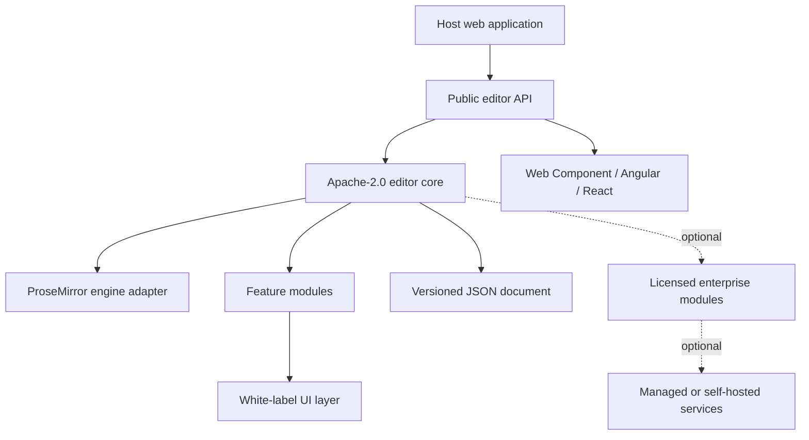

# Modern Rich Text Editor: Product Design Specification

**Status:** Approved design, pending written-spec review  
**Date:** 2026-08-27  
**Product type:** Open-core, embeddable web rich-text editor platform

## 1. Product decision

Build a fast, modern, fully white-labelable rich-text editor for business SaaS applications. The editor must be easy to embed in any web application, comparable to TinyMCE in integration simplicity but with a clearer API, stronger extensibility, accessibility, performance, and enterprise deployment model.

The product is an Apache-2.0 open-source core plus separately licensed enterprise modules. The core must be genuinely useful on its own; paid modules solve organizational-scale collaboration, governance, services, compliance, and support rather than withholding essential text editing.

## 2. Scope and decisions

| Topic | Decision |
|---|---|
| Primary use case | Business SaaS: forms, knowledge bases, composition, templates, comments, secure embedding |
| Core license | Apache-2.0 |
| White labeling | Required for all editions |
| Editing engine | Product-owned API and model over a ProseMirror adapter |
| Canonical format | Versioned editor-owned JSON document model |
| Interchange | Safe HTML import/export; Markdown import/export; print-ready PDF through host integration |
| Browser support | Current Chrome, Edge, Firefox, Safari; desktop-first authoring, responsive tablet/mobile support |
| Framework support | Framework-neutral TypeScript core, Web Component, first-party Angular and React packages |
| Storage and privacy | Client-side by default; host owns documents, identities, persistence, uploads, and authorization |
| Services | Optional, self-hostable and managed-cloud enterprise services with equivalent public APIs |
| Review | Core comments; enterprise suggestion mode; full tracked changes later |
| AI | Provider-neutral integration API only; no built-in model or mandatory cloud connection |
| Word interoperability | High-fidelity paste; safe HTML/Markdown interchange; defer editable DOCX import/export |
| Offline | No offline-first editing in v1; host owns autosave/retry; later with live collaboration |
| Accessibility | WCAG 2.2 AA baseline, keyboard-only operation, screen-reader support |

## 3. Architecture

The editor is a headless, schema-driven TypeScript platform. ProseMirror is an internal engine dependency only. Consumers must never depend on, import, or persist ProseMirror types. The product owns its public APIs, document schema, versioning, extension contracts, serializers, and UI.



### 3.1 Core components

1. **Public API:** stable TypeScript interfaces, typed events, command execution, lifecycle, import/export, and extension registration.
2. **Document model:** product-defined JSON schema with explicit document and extension versions; migration utilities preserve forward compatibility.
3. **Engine adapter:** translates product model and commands to/from ProseMirror. No engine type crosses this boundary.
4. **Feature modules:** independently loadable implementations for formatting, tables, links, media adapters, embeds, code blocks, mentions, comments, find/replace, paste cleanup, and accessibility behavior.
5. **UI layer:** toolbar, bubble menu, slash-command menu, dialogs, contextual controls, notifications, and design-token theming.
6. **Integration bridges:** Web Component, Angular component/form adapter, React components/hooks; all delegate to the same API.
7. **Extension SDK:** custom nodes, marks, commands, keyboard bindings, renderers, serializers, validators, and configuration schemas.

### 3.2 Service components (enterprise)

Optional services provide comments/review persistence, revision history, templates/content blocks, governed assets, identity integration, audit events, observability, and later CRDT collaboration. They must be deployable either as managed cloud or inside a customer-controlled environment. A host application can use the core without these services.

## 4. Public integration contract

The public API is framework-independent. Framework packages are thin adapters and have no behavior unavailable to direct TypeScript consumers.

```ts
const editor = createEditor({
  document: initialJson,
  extensions: [tables(), mentions({ provider }), customBlock()],
  upload: hostUploadAdapter,
  theme: { preset: 'brand', tokens: myTokens },
  events: { onChange, onSelectionChange, onError }
});

editor.getDocument();
editor.setDocument(json);
editor.export({ format: 'html' | 'markdown' | 'text' });
editor.execute('insertTable', { rows: 3, columns: 4 });
editor.destroy();
```

### 4.1 Contract rules

- The host owns storage, access control, retention, autosave, upload endpoints, and identity.
- Change events expose debounced full snapshots and structured document patches.
- HTML is parsed and emitted through a strict allow-list conversion pipeline. Never trust pasted markup.
- Custom blocks use declared JSON schemas and safe renderers.
- Network access is never implicit. An extension can reach a service only through a host-supplied adapter.
- The Web Component must support style isolation, host design tokens, accessibility labels, and localization without forcing a CSS reset.
- The library is unbranded by default. Product name, icons, strings, and controls are configurable.

## 5. Feature scope

### 5.1 Apache-2.0 core

- Paragraphs, headings, inline styles, links, lists, block quotes, code, horizontal rules.
- Tables, images/files through a host upload adapter, safe embeds, code blocks, mentions, placeholders, and slash commands.
- Undo/redo, keyboard shortcuts, selection toolbar, find/replace, character/word counts, paste cleanup, and basic comments.
- Versioned JSON documents, safe HTML and Markdown adapters, plain-text export, host-assisted PDF export.
- Extension SDK, custom blocks, TypeScript API, Web Component, Angular and React packages.
- Themes, design tokens, localization, configurable toolbar, accessible UI, and no mandatory telemetry.

### 5.2 Enterprise modules

- Suggestion mode, acceptance/rejection workflow, persistent comment service, immutable audit events, and later tracked changes.
- Templates/content blocks, governed asset services, document version history, document comparison, advanced migration/conversion.
- Self-hosted and managed-cloud services, OIDC/SAML, tenant isolation, policy packs, data retention, RBAC, observability, backups, and support.
- Governed AI actions: provider routing, approved prompts, policy controls, and audit records.
- Later: Yjs collaboration, presence, offline synchronization, editable DOCX conversion, and advanced compliance modules.

## 6. Security and privacy

- Validate JSON documents and all extension payloads against schemas.
- Sanitize all imported HTML. Remove scripts, event handlers, unsafe URL schemes, dangerous CSS, and unapproved embeds.
- Upload processing is delegated to the host application; the editor does not contain credentials or bypass host malware scanning and authorization.
- Embed providers are allow-listed; URLs are normalized; previews are sandboxed; hosts can add approval hooks.
- Telemetry is disabled by default. Optional diagnostics must exclude document content and PII.
- Release engineering must produce locked dependency manifests, SBOMs, vulnerability reports, signed artifacts, provenance, and security advisories.

## 7. Quality attributes and acceptance gates

### Accessibility

WCAG 2.2 AA compliance is a release gate. Every control must support keyboard navigation, clear focus management, semantic roles, accessible labels, high contrast, and screen-reader operation.

### Performance

CI must measure bundle size, startup time, typing latency, command latency, large-document rendering time, and memory usage. Budgets become release-blocking once baselines are established.

### Correctness

Test cross-browser selection, composition/IME, clipboard and Word paste, undo/redo, serialization round-trips, schema migrations, custom blocks, and HTML sanitization. Use property/fuzz testing for parser and transformation boundaries.

### Reliability

The core maintains a recoverable in-memory valid JSON snapshot. The host implements persistence/retry. Typed errors must be reported through events and never silently discard valid edits.

## 8. Delivery roadmap

1. **Foundation:** model, adapter, command system, schema/extension SDK, history, sanitizer, HTML/Markdown adapters, core UI.
2. **Adoption:** Web Component, Angular and React bridges, themes/locales, upload/media contracts, custom blocks, documentation site, migration guide.
3. **Production readiness:** accessibility, browser/IME/paste coverage, performance benchmarks, security hardening, release automation, observability.
4. **Enterprise v1:** comments service, suggestion mode, templates, versions, self-hosted/managed deployment, white-label administration.
5. **Enterprise v2:** Yjs collaboration, offline synchronization, tracked changes, DOCX conversion, advanced AI governance.

## 9. Explicit non-goals for v1

- Building a browser editing engine from scratch.
- Required hosted account, data collection, storage, or AI provider.
- Real-time co-editing, offline-first conflict resolution, full tracked changes, and editable DOCX conversion.
- A rigid UI framework, forced branding, or a host-wide CSS reset.

## 10. Technology rationale and references

ProseMirror’s model is schema based and its plugin system is appropriate for a controlled, internal editing-engine adapter. Its MIT license is compatible with an Apache-2.0 product core. Yjs is a high-performance, network-agnostic CRDT that is appropriate for a later optional collaboration service. Web Components provide custom elements and style encapsulation suitable for framework-neutral embedding.

- ProseMirror guide: https://prosemirror.net/docs/guide/
- ProseMirror repository and license: https://github.com/prosemirror/prosemirror
- Yjs documentation: https://docs.yjs.dev/
- MDN Web Components: https://developer.mozilla.org/en-US/docs/Web/API/Web_components
