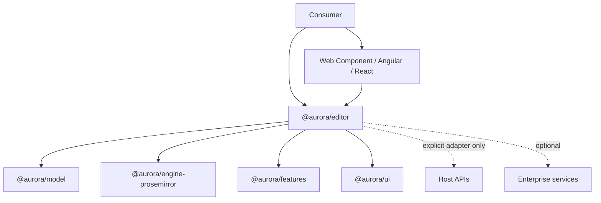

# Architecture

## Boundaries

@aurora/model owns schemas, validators, migrations, and canonical serialization. @aurora/editor owns the stable API. @aurora/engine-prosemirror is an internal adapter that consumers cannot import. Features are tree-shakable. UI consumes commands/events and never mutates engine state directly.

## Data flow

Validate and migrate incoming JSON before creating engine state. User actions dispatch product commands; the adapter returns transactions; the facade emits an immutable DocumentChange with document version, patch, origin, and diagnostics. The host persists it. HTML and Markdown are parsed to Aurora JSON and validated; foreign markup never reaches the engine directly.

## Invariants

- Persisted documents have format aurora and a positive schema version.
- Equivalent valid documents serialize deterministically.
- Extensions have a unique id and declared model version.
- Unknown extension content is rejected or shown only through a registered safe fallback; never silently discarded.
- Core has no implicit network, service, AI, identity, telemetry, or storage dependency.

